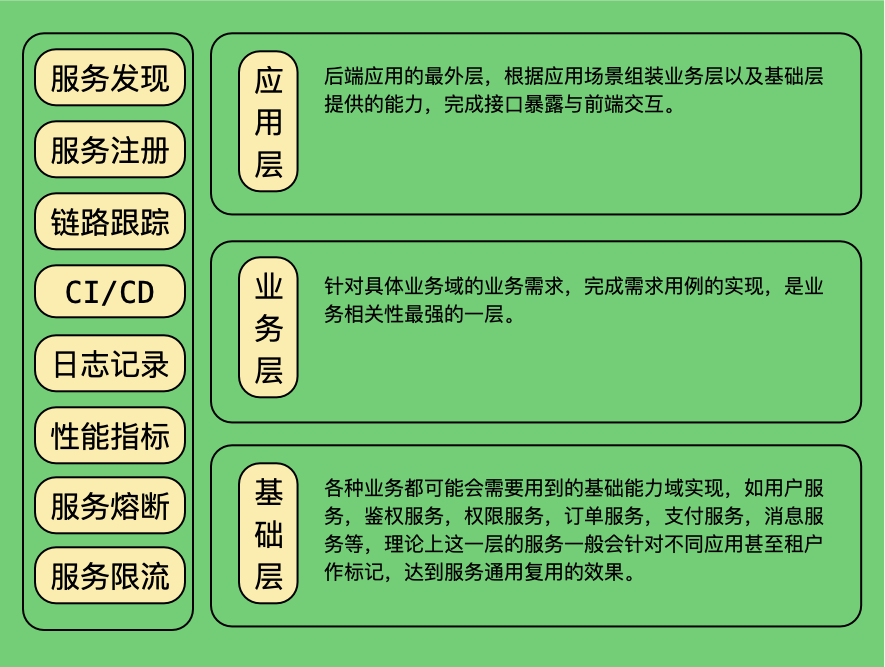

# gsv

这是一个自己心血来潮写的库，严格来说并不是一个框架。

希望对服务定义，发布，注册，发现，调用，跟踪等域进行抽象，封装底层实现。

## 架构

在我个人的理解中，我们一个系统的后端架构应该有以下几个层次，见附图：

## 主要概念

### 一、Service

一个Service应该是某一个域的实现，除了服务域的用例实现之外，我们应该描述这个服务名称，服务说明，以及根据服务被host的方式描述他每一个接口，包括路径、入参、出参等等。

### 二、Server

作为Service的承载物，一个Server可以包括多个Service，Server应该提供自己的基础信息，host的名字，ip，端口等等，以及注册Service的方法和运行方法。

### 三、Client

Service的Caller，向Server发起某个Service某个接口的调用，这里一般指后端各个域内微服务间的调用，暂时不包括前后端的调用。

## 实现思路

以下只是个人的一点理解，并不觉得自己是对的。我个人认为，golang本身是一个偏向反框架的语言。为什么这样子说呢，我们都知道golang语言自身是没有提供继承语义的，而在框架下开发这个行为本身，我的理解是按照框架设计者设计的签名，进行开发，实现逻辑，是一种以继承的方式进行开发的过程。而golang语言本身从语义上更偏向于组装的开发方式而并非继承的开发方式，我们熟知的golang下的继承，严格意义上也是把我们希望继承的父类的能力组装到当前类，从而达到继承的其中一些效果，本质上也只是组装而已。所以在这个库的初版，当我用到一些其他框架的时候，我是以能力作为考量去思考我需要用到什么，主要是思考我需要什么样的能力，而不是在什么样的框架下进行开发，更多是需要这个框架提供的某些能力，把能力组装到自己的库里面，而这些能力，理论上是可以替换的。这个库的出现也只是提供一个将能力按照我心里理想的后端架构快速的组装在一起的桥梁，其实这些能力都是可以重新实现可以替换的。所以我的构想中，这个库要达到我心里理想的状态，一是需要我按照我对架构的理解对概念进行抽象统一标准，另外就是尽可能依赖golang-sdk定义的标准作定义，达到各种能力的实现能快速兼容的目的，把定义和实现分开。但是话又说回来，我不是否定框架的存在，相反框架如果能很好的解决特定的问题，是十分重要的。只是在我自己希望实现的目标中，我更希望是通过组件的方式完成我的目标。虽然目前来说，并不很符合我的设计，比如service定义强依赖grpc这种设计，其实是跟我初衷相悖的，只能说继续努力，继续加油吧。写这个其实也没有什么目的性，只是把自己想到的记录下来，主要是怕自己忘记了，脑子不大好。-_-!!

## 具体实现

以下是一些目前实现的基本情况

### 脚手架代码结构

希望是按照clean architecture组织代码，todo: 未写完

### 一、Service、Server、Client

Service对应的其实是图中3层服务划分里面的各种服务。
应用层（BFF、API）：使用httpserver作为分发层与前端对接，配合gsv/cli库调用底层各服务作为域内实现。分发层参考一个叫negroni的库的实现，可以快速替换各种中间件甚至是底层网络库。
业务层、基础层(SVC)：使用grpc作为分发层，提供grpc服务，配合具体的业务实现，完成需求。

### 二、服务注册、服务发现

discovery包定义了基础的服务发现、服务注册接口，使用etcd实现了一个基础实现:
github.com/ringbrew/gsv-contrib/discovery/etcdiscov

### 三、链路跟踪

基于opentelemetry的golang-sdk封装了基本的http中间件以及grpc中间件。默认的Classics()返回的Option已经包含了对应的基础实现。

### 四、日志

logger包定义了基本的日志接口，使用zap和logrus分别实现了一个基础实现：
github.com/ringbrew/gsv-contrib/logger/zaplogger
github.com/ringbrew/gsv-contrib/logger/logruslogger

### 五、尚未完成

1、跟链路跟踪一样通过中间件实现prometheus监测服务指标，后续通过grafana提供面板。
2、BFF层路由和绑定、校验等未抽象，这些抽象后都需要通过能力的方式提供出去，需要用就用不想用就不用。